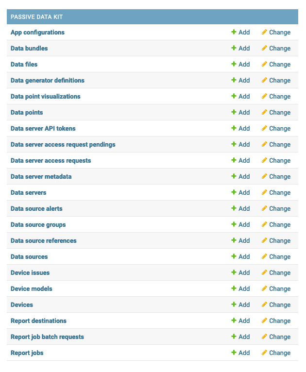
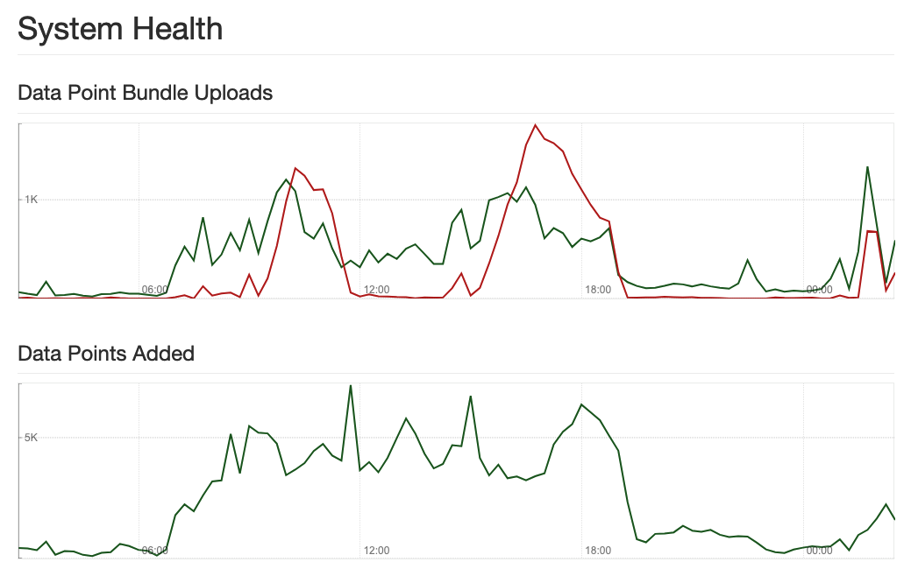
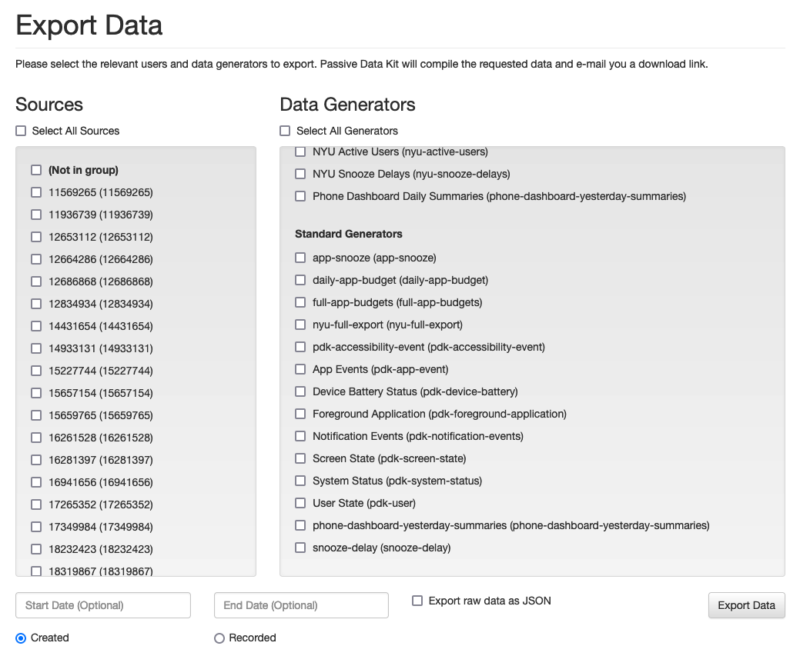

# Passive Data Kit: Django Server App

[](https://circleci.com/gh/bric-digital/PassiveDataKit-Django)


## About Passive Data Kit

Passive Data Kit (PDK) is a platform for gathering passively-acquired data from apps, web pages, browser extensions and more.

It is functionally a time-series database, where entries consist of hetergeneous "data points" that reflect something happening at some point in time. *Data points* can be sensor data (such as accelerometer readings from a mobile device), behavioral observations (such as which link a user selected from a list of search results in a browser), or information solicited from users at particular times (such as questionnaire or survey responses).

PDK is designed to provide reliable data collection in environments where reliable Internet connectivity cannot be taken for granted. PDK clients implement a "store and forward" architecture where *data generators* (PDK elements engaged directly in data collection) forward the data points that they emit to a local *data transmitter*, which typically includes a local database to gather data points to be tranmitted. Periodically, data transmitters will assemble *data bundles*, consisting of data points that have not yet been transmitted, and send those data points to a PDK server online, which functions as the central data aggregation hub for all of the remote PDK clients configured to transmit data points to that PDK server for further analysis and processing.

This repository contains the relevant core software for standing up a PDK server using the Django framework. Other repositories contain the various client implementations (e.g. [Android](https://github.com/bric-digital/PassiveDataKit-Android), [iOS](https://github.com/bric-digital/PassiveDataKit-iOS)) and add-on packages (e.g. [External Data](https://github.com/bric-digital/Passive-Data-Kit-External-Data), [Codebook](https://github.com/bric-digital/Passive-Data-Kit-Codebook)).


## Prerequisites

The PDK Django app has been developed primarily on Unix-like platforms and generally assumes the existence of tools such as CRON and Apache. This app MAY run Django installations on platforms such as Windows Server, at the cost of a greatly degraded experience and a larger complexity of setup.

Administrators seeking to install this app should be comfortable with [the Django web application framework](https://www.djangoproject.com/). PDK uses Django-specific features extensively and intentionally, and not just as a database front-end.

PDK targets the LTS releases of Django (1.11.X, 3.2.X, 4.2.X). It remains compatible with Python 2.7 and Python 3.6 and newer. We try to support a wide range of Python and Django releases, as PDK is used extensively in research settings, where it may not always be possible to attempt a large migration in the context of something like a clinical trial. That said, we **highly** recommend that if you are deploying a new site, to target the newest Django LTS release possible, to minimize the need for large upgrades and site migrations.

In addition to Django, PDK relies extensively on the Postgres database support included with Django, including the PostGIS extensions needed to enable spatial data types within Postgres. PDK supports Postgres 9.5 and newer.

To make your PDK server accessible to outside PDK clients, we typically configure Django with the Apache 2 webserver, using [mod_wsgi](https://modwsgi.readthedocs.io/) to facilitate communication between the front-end Apache web server and the Python application server. Typically, the bundled Apache server and mod_wsgi module that comes with your Unix distribution is more than sufficient to support Django.

A PDK server assumes that local users are able to set up and run CRON jobs. PDK uses CRON jobs for running periodic Django management commands to monitor server health, process new data bundles that have been uploaded, compiling and transmitting data reports, and a variety of other jobs. If you are unable to set up CRON jobs in your local environment, you will need to find another mechanism for running these tasks. Note that many of these tasks (such as compiling a large data report) will often run longer than the typical request timeout window web servers or clients will tolerate, so chaining these requests to HTTP endpoints that are triggered by an outside polling service **will not** be sufficient for these purposes.


## Installation

If you are operating in an environment that fulfills all of the requirements above, the first step to get started is to install the Django web application framework with Postgres and PostGIS enabled:

1. **(Strongly Recommended)** Before installing Django, [create a Python virtual environment](https://docs.python.org/3/library/venv.html) that will contain Django and all of the relevant dependencies separate from your host platform's own Python installation. Don't forget to activate your virtual environment before continuing!

2. Follow the instructions provided by the Django project to [install Django and its dependencies](https://docs.djangoproject.com/en/3.2/topics/install/). Remember to specify a Django LTS version, and not necessarily install the newest by default: `pip install Django==3.2.24`, **not** `pip install Django`.

3. After the base Django platform has been installed, enable GeoDjango and PostGIS by [following the instructions provided](https://docs.djangoproject.com/en/3.2/ref/contrib/gis/install/). Note that one some platforms (Red Hat Enterprise Linux, for one), the PostGIS packages may not be readily available. In that case, refer to [the PostGIS documentation for guidance](https://postgis.net/documentation/getting_started/) for your particular environment.

4. Once Django is fully installed, create a new Django project: `django-admin startproject myproject`. [Refer to the Django tutorial](https://docs.djangoproject.com/en/3.2/intro/tutorial01/) to understand how everything fits together.

5. Within your project, add the Passive Data Kit app by checking it out from Git: `git clone https://github.com/bric-digital/PassiveDataKit-Django.git passive_data_kit` (if you are not using Git to track changes yet) or `git submodule add https://github.com/bric-digital/PassiveDataKit-Django.git passive_data_kit` (if you would like PDK added as a submodule dependency).

6. If you have not already created a `requirements.txt` file to track your installed Python dependencies, create a new one with the contents:
  
    ```
    -r passive_data_kit/requirements.txt
    ```

   If you already have a requirements file, append that line to your existing one.

8. Install PDK's Python dependencies by running first `pip install wheel` and then `pip install -r requirements.txt` from your project directory. Installing the `wheel` package will allow `pip` to install precompiled Python packages. This can be a significant time saver and may help you avoid the need to install a ton of extra platform dependencies to compile the Python packages.

   In the event that you are adding PDK to an existing Django project, you may encounter some version mismatches between your pre-existing dependencies and the new ones PDK is introducing. Typically, this can be resolved by updating the conflicting dependencies with the latest versions available for your Python environment and updating `requirements.txt` accordingly. Note that the PDK projects use [GitHub's Dependabot service](https://docs.github.com/en/code-security/dependabot) to try and keep all of PDK's dependencies as up-to-date as possible, usually on a weekly update schedule.

9. Once the relevant Python dependencies have been installed, PDK must be enabled in your project by adding `passive_data_kit` to your settings' `INSTALLED_APPS` list, and adding the `data` path to the central `urls.py` file:

    ```python
    urlpatterns = [
        path('admin/', admin.site.urls),
        url(r'^data/', include('passive_data_kit.urls')), # Add this line!
        ...
    ]
    ```

   To enable the PDK server dashboard, be sure to define the following variables in your `settings.py` file:

    ```python
    PDK_DASHBOARD_ENABLED = True
    SITE_URL = 'https://' + ALLOWED_HOSTS[0] # If using this, verify that ALLOWED_HOSTS reflects the web
                                             # hostname you wish to use.
    ```
    
10. Once PDK has been enabled, initialize the database tables by making the local `manage.py` file executable, and running `./manage.py migrate`. You should see Django run through all the PDK migrations and create the relevant tables.

11. After the database tables have been created, [configure your local Apache HTTP server](https://docs.djangoproject.com/en/5.0/howto/deployment/wsgi/modwsgi/) to connect to Django.

    We **strongly recommend** that your configure Django to be served over HTTPS ([obtain a Let's Encrypt certificate if needed](https://letsencrypt.org/)) and to forward any unencrypted HTTP requests to the HTTPS port using a `VirtualHost` definition like:

    ````
    <VirtualHost *:80>
        ServerName myserver.example.com

        RewriteEngine on
        RewriteRule    ^(.*)$    https://myserver.example.com$1    [R=301,L]
    </VirtualHost>
    ````

12. Once Apache is configured and running, create a Django superuser account (if you have not already): `./manage.py createsuperuser`. The command will prompt you for a username, password, and e-mail address. Once you have provided those, install the static file resources `./manage.py collectstatic`. Finally, log into the Django administrative backend: `https://myserver.example.com/admin/` (replacing `myserver.example.com` with your own host's name. You should see the standard Django tables, *and* the new tables created by PDK:

    
    
Congratulations, you have (almost) successfully installed Passive Data Kit.


## Background Jobs Setup

Before your site is ready for use by clients, we have one more **very** important step to complete: setting up the background CRON jobs. We've broken this out into its own section in order to explain precisely what each job does, so you know what's happening when you and your users are not looking.

To start setting up your CRON jobs, log into the server using a local account that has enough permissions to run the Django management commands without any `root` permissions or access.

Launch the interactive CRON editor by running `crontab -e`.

Before you start defining job schedules, set up the shell to be used and the e-mail address to be notified if a job fails for some reason (first be sure that your server has been configured to send e-mails from the command line, which may be facilitated by an email API service such as [mailgun](https://mailgun.com)):

```
MAILTO=me@example.com
SHELL=/bin/bash
```

In this case, should any of the following jobs fail, `me@example.com` will receive the output generated by the failed job for troubleshooting purposes.

The following lines will take the following format:

```
<SCHEDULE_DEFINITION>    source <PATH_TO_VIRTUAL_ENVIRONMENT>/bin/activate && python <PATH_TO_PROJECT>/manage.py <DJANGO_COMMAND>
```

The `<SCHEDULE_DEFINITION>` is defined by [the CRON scheduling format](https://en.wikipedia.org/wiki/Cron). The next component beginning with `source` is responsible for setting up your virtual environment (from Step #1 above), so that the remainder of the line (`&&` onwards) executes the Django management commands using the dependencies you installed. You'll need to substitute in the actual values for `<PATH_TO_VIRTUAL_ENVIRONMENT>` and `<PATH_TO_PROJECT>` based on where these files reside on the local filesystem(s).

For the remainder of this section, we'll use `/var/www/venv` for `<PATH_TO_VIRTUAL_ENVIRONMENT>` and `/var/www/myproject` for `<PATH_TO_PROJECT>`.

On to the background jobs...

### pdk_process_bundles

`* * * * *    source /var/www/venv/bin/activate && python /var/www/myproject/manage.py pdk_process_bundles`

As mentioned above, PDK uses a "store and forward" design where clients generate *bundles* of *data points* that they periodically transmit to the server. This "bundle and transmit" process is used because its resiliant against network outages (if the transmission fails, wait and try to transmit again in the future) and it's **much** more battery efficient on mobile devices, compared to transmitting data to the server as it becomes available. By bundling the data points, PDK allows mobile devices to transmit more data at one time, which allows devices to put their radios back into power-saving mode when not transmitting, as opposed to keeping the radios active constantly for smaller intermittent data points.

When a PDK client transmits to a PDK server, it sends one data bundle per upload. Data bundles are simply JSON arrays that contain individual (heterogeneous) data points. The size of the data bundle is configured on the client to reflect the nature of the data being passively gathered and the environments in which the client may be deployed. In contexts where network connectivity is assumed to be strong, the client may be configured to send larger bundles of data less frequently. In more challenging network environments, larger bundle transmissions will fail more often (such as when the connection is interrupted), so a more frequent transmission schedule with smaller bundles may used.

Regardless of the client configuration, data first enters the PDK server as data bundles that are stored as `DataBundle` models. The PDK server **does not** process the bundles on upload, since it needs to return a response to the remote client as soon as possible, so that the next transmission can begin or the remote client can shut off its transmission hardware.

The **pdk_process_bundles** job is the main task responsible for processing the bundles in the background and extracting `DataPoint` objects that are stored in a separate table. This jobs basically starts by inspecting the `DataBundle` objects, seeking any where the `processed` field is `False`. The job will process the bundle into data points and update the `processed` field to `True`. It will query for another unprocessed bundle and repeat the process. It will continue this loop either until all bundles have been processed or it hits a limit for the number of bundles that it can process in one run. (The default is 1000 bundles, but this may be adjusted by setting the `PDK_BUNDLE_PROCESS_LIMIT` variable in `settings.py` to a larger threshold.)

Note that while the CRON job above is configured to run every minute, processing bundles may take more time than that. Each of these CRON jobs use a locking mechanism where a running job will create a lock file (typically in the `/tmp` directory) while it's working, and delete it when it's finished. If a new instance of the `pdk_process_bundles` command runs and a lock file is present, it will exit quickly to prevent two processes from doubling up on processing the same data at the same time, creating duplicate `DataPoint` objects.

In the event that a background job exits and fails to remove its lock file (such as being terminated by the system for exceeding the local available memory), it is the responsibility of *the human operator (you)* to log into the system, remove the lock file of the terminated job so that processing can resume. This is precisely the reason we began this section by setting up the CRON file's `MAILTO` option to an externally-reachable e-mail address.

### pdk_clear_processed_bundles

`0 3 * * *    source /var/www/venv/bin/activate && python /var/www/myproject/manage.py pdk_clear_processed_bundles`

Once `DataBundle` objects have been processed, the system has no more need of them, and they can be safely deleted. The **pdk_clear_processed_bundles** job clears out that unneeded data so that the local database doesn't grow too large. Note that this job doesn't need to be run frequently - in the line above, this runs at 3 AM server time every day.

### pdk_update_server_health

`*/15 * * * *    source /var/www/venv/bin/activate && python /var/www/myproject/manage.py pdk_update_server_health`

This optiona job inspects the `DataBundle` objects to determine how many have been processed since the last check and to measure how many pending items remain. This information is displayed on the Passive Data Kit dashboard at `https://myserver.example.com/data/system-health`:



Green lines represent bundles processed and red lines represent bundles pending. While it's no problem for the pending bundles (red line) to exceed the processed bundles (green line) height periodically, should the processed bundles not return to zero over time, this is evidence that data is being transmitted to the PDK server faster than it's being processed, which indicates a need for server tuning (a subject beyond the scope of this document) or deploying more data collection servers using PDK's server federation features (also beyond the scope of this document).

In the example above, this job is configured to run every 15 minutes, which is a sensible default to start with.

### pdk_compile_reports

`* * * * *    source /var/www/venv/bin/activate && python /var/www/myproject/manage.py pdk_compile_reports`

While `DataPoint` objects are stored (primarily) as JSON text, most analysts prefer to receive data in a more structured format, such as tab-delimited text that can eaily be loaded into statistical programs such as R or STATA and spreadsheets such as Excel. **pdk_compile_reports** is the background job that processes data report jobs (`DataReportBatchRequest` and `DataReportJob` objects) into usable files.

Analysts may request reports from the data export interface at `https://myserver.example.com/data/export`.



They would select the data sources that they are interested in from the column on the left, and the data types of interest from the column on the right. The requested data can be time-bound either by when the data was captured by the client (the *created* date) or when it was recorded on the server during bundle processing (the *recorded* date). The requestor can also specify if they would prefer to receive the data in processed form (the default) or as raw JSON files that they can process themselves.

When an analyst requests a data export, PDK creates a `DataReportBatchRequest` object that describes the request. When the **pdk_compile_reports** job runs, it will inspect any new `DataReportBatchRequest` object and split it into `DataReportJob` objects. Given that the volume of data requested may be extremely large, this splitting functionality divides the request into manageable sizes that both respect the local system memory limits, while also limiting to what extent unweildy large export files can be generated. Typically, for large requests, the jobs are split up into groups of data sources, where all of the data associated with a particular data source will reside in the same export file.

Some export jobs may take hours or days to run, which is the reason for a background batch-processing arrangement, instead of simply providing the requestor a link to download the file (which will timeout well before the job is completed).

When a report job is finished, PDK typically sends an e-mail to requestor with a link to download the output. Since it is pretty common for jobs to generate export files on the order of tens or hundreds of megabytes, sending those files as attachments is rarely feasible.

By default, PDK provides a number of reports for standard PDK data types (e.g. `pdk-location`, `pdk-system-status`, etc.). You can inspect the code that implements the export job by choosing one of the data types in the [`generators`](https://github.com/bric-digital/PassiveDataKit-Django/tree/main/generators) folder and inspecting the `compile_report` method that is responsible for translating the raw JSON data into something more structured for analysis. Note that in addition to the standard reports that are included in the PDK Django app, this mechanism may be extended by creating a `pdk_api.py` file in *another* Django app, and implementing the `compile_report` function using the default PDK implementation in its own [`pdk_api.py`](https://github.com/bric-digital/PassiveDataKit-Django/blob/main/pdk_api.py) as an example.

### pdk_run_status_checks

`*/5 * * * *    source /var/www/venv/bin/activate && python /var/www/myproject/manage.py pdk_run_status_checks`

*(Description coming soon)*

### pdk_update_performance_metadata

`*/5 * * * *    source /var/www/venv/bin/activate && python /var/www/myproject/manage.py pdk_update_performance_metadata`

*(Description coming soon)*

*(Description coming soon)*

### pdk_compile_visualizations

`*/5 * * * *    source /var/www/venv/bin/activate && python /var/www/myproject/manage.py pdk_compile_visualizations`

*(Description coming soon)*

## License and Other Project Information

Copyright 2015-2025 Behavioral Research Innovation Center

Licensed under the Apache License, Version 2.0 (the "License"); you may not use this file except in compliance with the License. You may obtain a copy of the License at

[http://www.apache.org/licenses/LICENSE-2.0](http://www.apache.org/licenses/LICENSE-2.0)

Unless required by applicable law or agreed to in writing, software distributed under the License is distributed on an "AS IS" BASIS, WITHOUT WARRANTIES OR CONDITIONS OF ANY KIND, either express or implied. See the License for the specific language governing permissions and limitations under the License.
